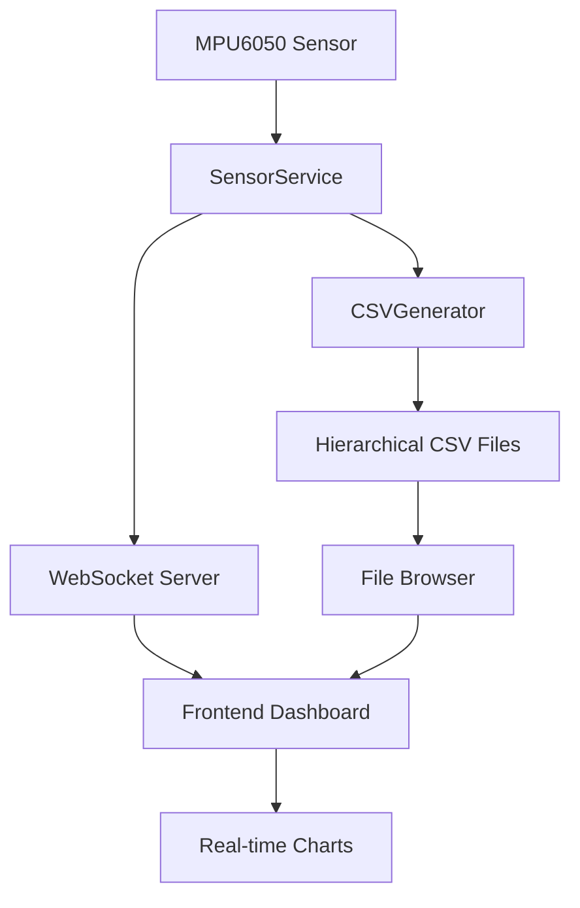

# 🚀 Raspberry Pi Deployment Guide

## 📋 Pre-Deployment Checklist

### ✅ **System Requirements:**
- Raspberry Pi 4 (recommended) or Pi 3B+
- Raspbian OS (Bullseye or newer)
- Python 3.8+ installed
- Node.js 18+ installed
- MPU6050 sensor connected via I2C
- Internet connection for initial setup

### ✅ **Hardware Setup:**
1. **MPU6050 Connections:**
   - VCC → 3.3V
   - GND → Ground
   - SDA → GPIO 2 (Pin 3)
   - SCL → GPIO 3 (Pin 5)

2. **Enable I2C:**
   ```bash
   sudo raspi-config
   # Navigate to Interface Options → I2C → Enable
   sudo reboot
   ```

## 🔧 **Backend Deployment:**

### 1. **Install Python Dependencies:**
```bash
cd backend
pip3 install -r requirements.txt
```

### 2. **Test Sensor Connection:**
```bash
python3 main.py
# Should show sensor readings if connected properly
```

### 3. **Start Backend Service:**
```bash
python3 backend_service.py
```

### 4. **Create Systemd Service (Optional):**
```bash
sudo nano /etc/systemd/system/wilo-backend.service
```

Add this content:
```ini
[Unit]
Description=WILO Sensor Backend Service
After=network.target

[Service]
Type=simple
User=pi
WorkingDirectory=/home/pi/wilo-project/backend
ExecStart=/usr/bin/python3 backend_service.py
Restart=always
RestartSec=10

[Install]
WantedBy=multi-user.target
```

Enable and start:
```bash
sudo systemctl enable wilo-backend.service
sudo systemctl start wilo-backend.service
```

## 🌐 **Frontend Deployment:**

### 1. **Install Node.js Dependencies:**
```bash
cd frontend
npm install
```

### 2. **Build for Production:**
```bash
npm run build
```

### 3. **Start Production Server:**
```bash
npm start
```

### 4. **Access Dashboard:**
- Open browser: `http://localhost:3000`
- Or from another device: `http://[PI_IP_ADDRESS]:3000`

## 🔍 **Verification Steps:**

### ✅ **Backend Health Check:**
1. Check service status: `sudo systemctl status wilo-backend`
2. View logs: `sudo journalctl -u wilo-backend -f`
3. Test WebSocket: `curl -i -N -H "Connection: Upgrade" -H "Upgrade: websocket" -H "Sec-WebSocket-Key: test" -H "Sec-WebSocket-Version: 13" http://localhost:8765`

### ✅ **Frontend Health Check:**
1. Dashboard loads without errors
2. WebSocket connection shows "Connected"
3. Sampling rate controls work
4. Calendar browser opens with dummy data
5. Charts display properly

### ✅ **Data Flow Check:**
1. CSV files created in `backend/readings/` folder
2. Files organized by date hierarchy
3. WebSocket messages flowing
4. Real-time updates working

## 🚨 **Troubleshooting:**

### **Sensor Issues:**
- Check I2C connection: `sudo i2cdetect -y 1`
- Should show device at address 0x68
- Verify wiring connections

### **Permission Issues:**
- Add user to i2c group: `sudo usermod -a -G i2c pi`
- Restart session or reboot

### **WebSocket Issues:**
- Check firewall: `sudo ufw status`
- Ensure port 8765 is open
- Check if service is running: `netstat -tlnp | grep 8765`

### **Frontend Issues:**
- Check Node.js version: `node --version`
- Clear npm cache: `npm cache clean --force`
- Rebuild: `rm -rf node_modules && npm install`




